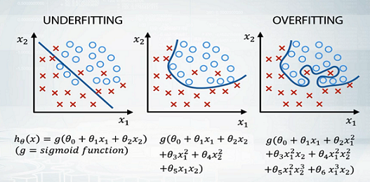
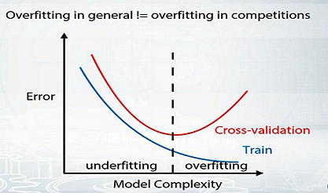

# Validation and overfitting

### 为什么你的私榜排名一落千丈？

在私榜发布时，你会发现有人成绩掉落，这种情况并不罕见。发生了什么？造成这些跳转的原因主要有两个。
- 第一，竞争者可能忽略验证，并选择对公共排行榜得分最好的提交。First, competitors could ignore the validation and select the submission which scored best against the public leaderboard. 
- 第二，就是有时候比赛没有一致的公共私人数据分割，或者他们的公共或私人排行榜的数据太少。Second, is that sometimes competitions have no consistent public/private data split or they have too little data in either public or private leaderboard. 

参赛者不能影响比赛的组织，但可以确保我们选择最合适的提交材料，由私人排行榜进行评估。因此，接下来的主要目标是为您提供一个系统化的方法来设置比赛中的验证，并解决最常见的验证问题。

### 我们该怎么做？

我们不希望模型出现过拟合，我们需要用我们拥有的数据来检查模型的质量，这些检查就是验证。
比赛的组织者会把数据分两块给我们。第一，有所有目标值的训练数据。第二，没有目标值的测试数据。`我们应该把带标签的数据分成训练和验证两部分`。此外，为了保证比赛精神，主办方将测试数据分为公共测试集和私人测试集。当我们把提交的数据发送到平台上时，我们看到的是公共测试集的分数，而私人测试集的分数是在比赛结束后才公布的。这也保证了我们不需要测试集，或者说在模型方面不超标。

### 过拟合与欠拟合的trade-off

##### 举个例子

我用疾病预测给大家打一个比方，如果我们已经把我们的数据分为训练和验证部分。而现在，我们在反复的对照验证集检查我们的模型，那么有些模型，就会偶然的比其他模型有更好的分数。如果我们继续选择最好的模型，修改它们，再从中选择最好的，我们会看到分数的不断提高。但这并不意味着我们会在未来的测试数据上看到这些改进。通过不断的重复，我们可能只是实现了验证集，或者在比赛方面，我们可能只是在公共排行榜上作弊。但同样，如果过度拟合，私人排行榜会让我们失望。这就是我们所说的比赛中的过度拟合。在公共排行榜上得到一个不切实际的好成绩，后来导致在私人排行榜上跳下来。

我们希望我们的模型能够捕捉到数据中的模式。
让我用欠拟合和过拟合来告诉你这个过程。一个非常简单的二元分类测试的例子。
- 如果模型太简单，就无法捕捉到下划线的关系，我们会得到很差的结果（欠拟合）。
- 如果我们想让我们的结果提高，我们可以增加模型的复杂度，这样可能会发现`训练数据`上的质量是会下降的。
- 另一方面，如果我们做了太复杂的模型，它将开始在训练数据中描述噪声，而不能概括测试数据。而这将导致模型的质量下降。这就是所谓的过拟合。

所以，我们在这里要的是介于欠拟合和过拟合之间的东西。而为了选择最合适的模型，我们希望能够评估我们的结果。
在这里，我们需要说一下，一般机器学习中的过拟合和过拟合比赛的意义是略有不同的。在一般情况下，如果模型在训练集上的质量比测试集上的质量好，我们就说模型是过拟合的。但在竞赛中，我们经常说，只有当测试集上的质量会比我们预期的差时，模型才是过拟合的。

比如说，如果你在比赛中训练梯度提升决策树就是我们的曲线下面积指标。我们有时可以观察到，训练数据上的质量接近于1，而测试数据上的质量可能更低，比如接近0.9。在一般意义上，这里的模型是过拟合的，但虽然我们在验证和公共私人测试集上得到的曲线下面积都是0.9，但我们不会说它在比赛的情况下是过拟合的。

为了评估模型，我们把数据分为两部分。训练和验证部分。就像我们已经做的那样，我们会将模型的复杂度从低到高推导出来，然后看这里的模型。注意，通常，我们理解的错误或损失是与模型的质量或分数相反的东西。在图中，这种依赖关系看起来非常合理。对于两个简单的模型，我们有欠拟合，这意味着在训练和验证上都比较高。对于两个复杂的模型，我们有过拟合，这意味着在训练上的误差较低，但在验证上的误差又较高。在中间，在它们之间，如果完美模型的复杂度，它在验证数据上的训练最低，因此我们希望它在未见测试数据上的误差最低。注意，这里的训练误差总是优于测试误差，这意味着一般意义上的过拟合，但在比赛中并不适用。

### 总结

再次强调，一般来说，验证可以帮助我们回答这样一个问题，我们的模型在未观察到的数据上的质量会如何，帮助我们选择有望在该测试数据上获得最佳质量的模型。通常情况下，我们一方面要避免欠拟合，即我们希望我们的模型有足够的表现力来捕捉数据中的模式。而我们在另一个方面是试图避免过拟合，不要做太复杂的模型，因为在这种情况下，我们会开始捕捉到噪声或模式，而这些模式并不能泛化到测试数据上。