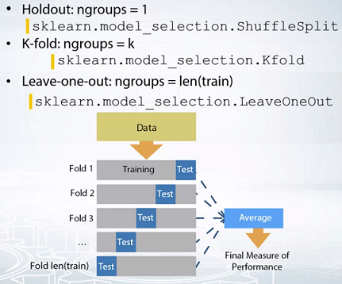

# Validation strategies


在之前的视频中，我们了解到验证可以帮助我们选择一个模型，这个模型在未见过的测试数据上表现最好。但是，为了使用验证，我们首先需要将数据在给定的标签情况下划分成训练和验证。But, to use validation, we first need to split the data with given labels, entrain, and validation parts.

### 不同验证策略
通俗地讲，这些验证策略之间的主要区别在于所做的分裂次数。这里我将讨论其中的三种。
- 第一是 holdout，
- 第二是 K-fold，
- 第三是 leave-one-out。



####  holdout

这是一种简单的数据拆分，它将数据分为两部分，训练和验证（这里很重要的一点是，在任何方法中，包括holdout在内，一个样本既可以去训练，也可以去验证）。所以要保证训练和验证之间的样本不重叠。

当我们的数据中有重复的样本时，我们会对这些样本得到更好的预测，整体上所有的估计也会更加乐观。很容易看出，这些会阻碍我们为模型`选择最佳参数`。

当我们有`足够的数据`时，这通常是一个不错的选择。如果我们尝试不同的分割，我们很有可能为同一个模型得到相似的分数。


####  K-fold

K折。可以看作是一种重复的保留，因为我们将数据分成关键部分，并对它们进行迭代，只将每一部分作为一次验证集。在这个过程之后，我们对这些K-fold进行平均得分。在这里，理解K-fold和holdout或K-times之间的区别是很重要的。
K-fold的核心思想是，我们希望每个样本只用一次验证。当我们拥有最小的数据量，并且我们可以得到足够大的质量差异，或者不同折线之间的最佳参数不同时，这种方法是一个不错的选择。

####  leave-one-out

留一法。是Kfold的一个特殊情况，当K等于我们数据中的样本数时。如果我们的`数据太少`，而模型又刚好够夹带的话，这种方法会很有帮助。

### 总结

Shuffle数据并使用holdout或者K-fold划分数据集（By shuffling data we are trying to reproduce random trained validation split.）。通过洗牌数据，我们是想重现随机训练的验证分裂（By shuffling data we are trying to reproduce random trained validation split. ）。但有时，特别是当你对某些类没有足够的样本时，随机拆分可能会失败。

> 让我们考虑一下，一个例子。我们有二元分类测试和一个有八个样本的小数据集。四个零类的，四个一类的。让我们把数据分成四个折。完成了，但是请注意，我们在同一个问题中并不是总是得到0和1。
> 如果我们将使用第二折进行验证，将得到目标在训练集的平均值为两个三分之一，而不是二分之一。这就会极大地改变我们模型的预测。
> 分层解决。它就是保证我们在不同情况下得到的目标分布式相似的。如果我们把数据分成四个分层的断层，每个错误目标值的平均值将等于一半。

#### 分层的重要性


```diff
+ 以下情况采用分层：
```

```diff
- 小数据集。
- 不平衡的数据集。
- 类别很多的多类分类任务。
```

对于好的分类数据集，分层拆分会和简单的洗牌拆分很相似，也就是随机拆分。

总之，
- 如果我们有足够的数据，并且我们有可能在不同的分割中得到相似的分数和最佳模型的参数，我们可以选择Holdout。
- 如果相反，在不同的分割中，分数和最优参数不同，我们可以选择KFold方法。
- 如果我们数据太少，我们可以应用leave-one-out。
- 第二大启示应该是分层。它有助于让验证更加稳定，尤其是对于小数据集和不平衡的数据集来说非常有用。


------------------------------------------------------------------

```diff
+ 补充材料：


你应该知道的主要规则是--永远不要用你训练的数据来衡量你的模型的质量。诀窍是将你的所有数据分成训练和验证部分。

下面你会发现几种验证模型的方法。

+ a) Holdout方案。

将训练数据分成两部分：partA和partB。
在partA上拟合模型，对partB进行预测。
使用对partB的预测来估计模型质量。找到这样的超参数，使partB的质量最大化。

+ b) K-Fold方案。

将训练数据分割成K折。
迭代每一折：在除当前折外的所有折上重新训练模型，对当前折进行预测。
使用预测结果计算每折的质量。找到使每折的质量最大化的超参数。你也可以估计损失的平均值和方差。这对于理解改进意义是非常有帮助的。

+ c) LOO（Leave-One-Out）方案。

对样本进行迭代：对除当前样本以外的所有样本进行模型再训练，对当前样本进行预测。你需要重新训练模型N次（如果N是数据集中的样本数）。
最后，你将得到trainset中每个样本的LOO预测，并可以计算损失。

! 注意，这些验证方案应该是用来估计模型的质量。当你找到正确的超参数并想得到测试预测时，不要忘记使用所有训练数据重新训练你的模型。

```


