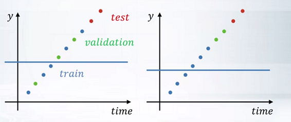
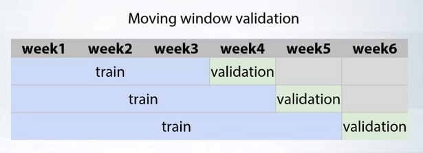

# Data splitting strategies

- 所以在第一种情况下，如果验证点与测试点相比会更接近这个均值，我们在验证中会比测试中得到更好的分数。

- 但是在第二种情况下，验证点与测试点相比，距离目标均值的距离大致相同。所以，在第二种情况下，验证分会和测试分比较接近。

很好，我们刚刚发现，在验证不正确的情况下，不仅是特征，而且目标值也会导致不切实际的分数估计。现在，这个例子和你在解决实际竞赛时可能遇到的情况很相似。众多比赛都使用了基于时间的拆分即：Rossmann商店销售比赛、Grupo Bimbo库存需求比赛等。所以，快速总结一下我们刚才讨论的这个有价值的例子，不同的拆分策略会有很大的不同，即：在生成的特征上，在模型将依赖该特征的方式上，以及在某种目标泄漏上。这意味着，为了能够找到生成特征的聪明想法，并持续改进我们的模型，我们绝对要找出组织者（包括比赛）所做的训练/测试拆分，并重现它。现在让我们对这些拆分策略和比赛中的大部分进行分类，并讨论它们的例子。

大多数拆分可以统一为三类：
- 随机拆分
- 基于时间的拆分
- 基于ID的拆分

#### 随机拆分

按行随机拆分数据。这通常意味着行之间是相互独立的。
例如，我们有一个预测客户是否会单独付款的测试。每一行代表一个人，这些行之间相当独立。现在，让我们考虑到有一些依赖性，例如，家庭成员或在同一公司工作的人。如果一个丈夫能够支付一笔贷款，那么他的妻子可能也能做到。这就意味着，如果不幸的是，丈夫会出现在训练数据中，而他的妻子会出现在测试数据中。我们也许可以探索一下，为这种情况设计一个特殊的功能。因为在这样的可能性中，实现这样的功能真的很有趣。

#### 基于时间的拆分

把某个日期之前的所有内容作为训练数据，日期之后的评分作为测试数据。这可以成为一个信号，使用特殊的方法来生成特征，特别是根据目标做出有用的特征。比如说，如果我们要预测下周每天店铺的顾客数量，我们可以得出类似于上一周同一天的顾客数量，或者上个月的平均顾客数量。正如我之前提到的，这种拆分方式已经很普遍了。在罗斯曼门店销售竞赛和Grupo Bimbo库存需求竞赛中，以及其他的竞赛中，都使用了这种方法。基于时间的拆分的一个特殊的验证情况是移动窗口验证。在前面的例子中，我们可以移动划分训练和验证的日期。连续使用一周又一周作为验证集，就像这张图片上一样。

#### 基于ID的拆分

ID可以是用户、店铺或任何其他实体的唯一标识符。例如，让我们想象一下，我们必须为全新的用户解决一个音乐推荐的任务。这意味着，我们在训练和测试中有不同的用户集。如果是这样，我们大概可以得出一个结论，基于用户历史的特征，比如用户在上周听了多少首歌曲，对完全新用户没有帮助。作为基于ID的拆分的例子，我想给大家讲一下卡特彼勒定价竞争（the Caterpillar to pricing competition）。在那场竞争中，训练/测试的拆分是在一些品类ID上进行的，即tube ID。

没有ID怎么办？聚类。
有一个有趣的案例，当我们应该采用基于ID的拆分，但ID对我们来说是隐藏的。
在这里，我想提两个隐藏了基于ID的拆分的比赛的例子。这包括`英特尔和孟买ODT宫颈癌筛查比赛`（Intel and MumbaiODT Cervical Cancer Screening competition），以及`大自然保护协会渔业监测比赛`（The Nature Conservancy fisheries monitoring competition.）。在第一个比赛中，我们必须将患者分为三个等级，对于每个患者，我们有几张照片。事实上，一个病人的照片属于同一个等级。同样，来自训练和测试的病人集没有重叠。而我们也应该确保这些在训练条例中的分割。另一个例子，在The Nature Conservancy渔业监测比赛中，有来自几艘不同渔船的鱼的照片。同样，渔船和训练和测试也没有重叠。所以，如果你会忽略风险，做一个基于随机的拆分，很容易过拟合。因为没有给出ID，选手们必须自己推导出这些ID。在这两种比赛中，可以通过聚类图片来实现。最简单的情况是，图片只是一张接一张地拍，所以图片很相似。你可以在这些比赛的内核中找到更多关于这种聚类的细节。

#### 组合拆分

现在，在这两个主要的独立方法中，我们还需要知道，它们有时可能会被结合起来。比如说，如果我们有一个预测店铺销量的任务，我们可以为每个店铺独立选择一个拆分的日期，而不是对数据中的每个店铺都使用一个日期。又比如，如果我们有多个用户的搜索查询，是使用多个搜索引擎，我们可以通过用户ID和搜索引擎ID的组合拆分数据。组合拆分的比赛例子包括德勤的西澳租房价格比赛和他们的数据科学游戏2017的资格阶段。在第一个比赛中，训练/测试是由一个单一的日期进行拆分，但公共/私人的拆分是由不同地理区域的不同日期进行的。在第二场比赛中，参赛者必须预测在线音乐服务的用户是否会听歌。训练/测试的拆分方式如下。对于每个用户来说，他听的最后一首歌被放入测试集，而其他所有的歌曲被放入训练集。这些是比赛中采用的主要拆分策略。

## 总结

总之，你的验证应该始终模仿组织者做出的训练/测试拆分。它可以是一些非平凡的东西。例如，在家得宝产品搜索相关性竞赛中，参与者被要求估计搜索相关性。一般来说，数据由搜索词和这些词的搜索结果组成，但测试集包含全新的搜索词。所以，我们无法使用随机拆分或基于搜索词的拆分进行验证。第一次拆分有利于更复杂的模型，导致过拟合，而第二次拆分则相反，导致欠拟合。所以，为了选择最优的模型，关键是要模仿训练/测试拆分的新搜索词的比例。很好，就是这样。就是这样。我们刚刚演示了比赛中采用的主要数据拆分策略。随机拆分，基于时间的拆分，基于ID的拆分，以及它们的组合。这将帮助我们建立可靠的验证，对特征生成做出有用的决策，并最终选择在测试数据上表现最好的模型。