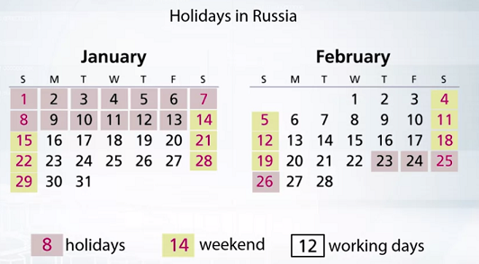
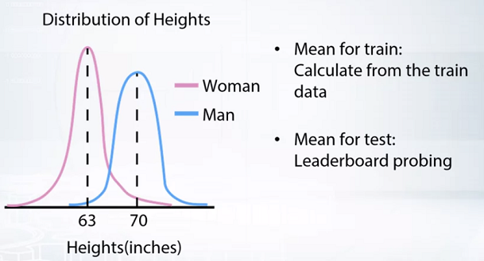
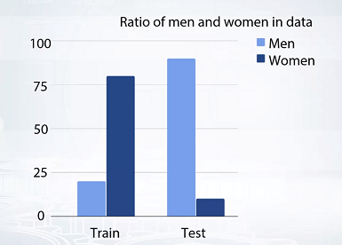
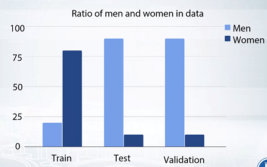

# Problems occurring during validation

## 问题

在做了数据划分之后，我们希望在验证上看到的分数和私人排行榜一样。或者至少，如果我们改进了我们的模型和验证，私人排行榜上也会有改进。
但有时我们会在这里遇到一些问题。在大多数情况下，这些问题可以分为两个大组。

- 第一组是我们在本地验证时遇到的问题。通常它们是由数据的不一致引起的，一个普遍的例子是对不同的故障得到不同的最优参数。在这种情况下，我们需要进行更彻底的验证。（ Usually they are caused by inconsistency of the data, a widespread example is getting different optimal parameters for different faults. ）

- 第二组的问题，往往是在我们将提交的数据发送到平台时才会显现出来。并观察到验证和排行榜上的分数并不匹配。在这种情况下，问题的发生通常是因为我们无法在验证上模仿准确的训练测试划分。

这些都是棘手的问题。对于验证和提交阶段，我们将讨论主要的问题，它们的原因，如何处理它们。然后，我们将讨论一下什么时候可以期待排行榜的洗牌。

## 验证阶段问题

让我们从讨论验证阶段的问题开始。通常，它们会在验证期间引起我们的注意。一般来说，主要的问题是不同的训练验证划分的分数和最佳参数的显著差异。
举个例子。考虑到我们需要预测一家商店在2月份的销售额。假设我们有去年的目标值，而且，通常情况下，我们会在验证中取最后一个月。这意味着1月份，但显然1月份的假期比2月份多得多。而人们往往会购买更多的东西，这就导致目标值整体较高。而我们对1月份的预测的均方误差会大于2月份。这是否意味着该模块在2月份的表现会更差？可能不会，至少在过度拟合方面不会。

我们可以看到，有时这种模型行为是可以预期的。让我们找出几个常见的原因，看看我们能做些什么。

- 第一个假设我们应该考虑，我们的数据太少。
例如，考虑一种情况，当我们的数据中有很多模式和趋势。但我们没有足够的样本来很好地概括这些模式。在这种情况下，一个模型将只利用一些通用模式。而对于每一次的训练、验证划分，这些模式会有部分差异。这的确会导致模型的得分不同。而且，每次的验证样本都会不同，只会增加不同折分数的分散性。

- 第二种，是数据过于多样化和不一致。
比如，如果你的样本非常相似，但目标方差不同，模型就会混淆。考虑两种情况，首先，如果其中一个这样的例子在训练中，而另一个在验证中。我们可以为第二个样本得到一个相当高的误差。而第二种情况，如果两个样本都在验证中，我们会对它们得到较小的误差。或者让我们记住另外一个例子，就是我们前面已经讨论过的多样化数据。

在这里，我们有了分数差异的性质或原因。大家注意一下，在这个例子中，如果我们会对上一年的2月份进行验证的话，我们可以减少一点这种多样性。所以，造成不同折分数和最优模型参数差异的主要原因，一是数据太少，二是数据太多样化和不一致。

如果我们面对这种问题，可以进行更`彻底的验证`。你可以在K-Fold中增加K，但通常5个fold就够了。用不同的随机拆分做几次K-Fold验证。并求出平均分，以得到一个比较稳定的模型质量估计。如果有过拟合风险，我们可以同样的方法选择模型的最佳参数。用一组K-Fold splits来选择参数，用另一组K-Fold splits来检查模型的质量是很有用的。需要广泛验证的比赛例子包括Liberty Mutual集团物业检查预测比赛和Santander客户满意度比赛。在这两个比赛中，参赛者的分数都非常接近。因此参赛者试图从数据中榨取更多的数据。但不要过度适应，所以彻底的验证是至关重要的。

## 提交阶段问题

有时候，你可以在细心的过程中诊断出这些问题。但还是经常会在你向平台提交解决方案时才遇到这类问题。一般来说，这类问题有两种情况：
- 第一种情况，排行榜分数一直高于或低于验证分数。
- 在第二种情况下，排行榜得分与验证得分完全不相关。

所以在最坏的情况下，我们可以提高验证的分数。而相反，在排行榜上的分数会降低。你可以想象，这些问题可能会更麻烦。现在请记住，做一个可靠的验证的主要规则，是模仿组织者预先做的训练、测试划分。识别和模仿准确的训练、测试划分可能是相当困难的。正因为如此，我强烈建议你在参加比赛后就开始提交你的解决方案。好开始探索这个问题的其他可能根源。

让我们先梳理一下我们在验证阶段可以观察到的原因。回忆一下，我们在验证期间已经在不同的折上有不同的模型得分。在这里，将排行榜看作另一个验证折是很有用的。那么，如果我们在K-Fold中已经有了不同的分数，在排行榜上得到一个不是很相似的结果也就不足为奇了。更多的我们可以计算验证分数的均值和标准差，并估计排行榜上的分数是否符合预期。但如果不是这样，那么肯定是有问题的。这个问题可能还有两个原因。

- 第一个，我们在公共排行榜中的数据太少了，这很容易解释。只要相信你的验证，一切都会好起来的。
- 第二个，训练和测试数据来自不同的分布。让我解释一下我说的不同分布是什么意思。

> 考虑通过人们在Instagram上的照片来预测人们身高的回归测试。蓝线代表男性的身高分布，而红线代表女性的身高分布。你可以看到，这些分布是不同的。现在我们试想一下，训练数据只由女性组成，而测试数据只由男性组成。那么所有的模型预测都将围绕女性的平均身高。而这些预测的分布将与训练数据的分布非常相似。难怪我们的模型在测试数据上会有一个糟糕的成绩。
> 少见的情况。我们先说说解决这类问题的一般方法。从最广义的层面来说，我们需要找到一种方法来解决训练和测试中的不同分布。有时候，这类问题可以通过在训练过程中调整你的解决方案来解决。但有时候，这种问题只能通过排行榜调整你的解决方案来解决。那就是通过排行榜探查。在比赛中，解决这种特殊情况的最简单的方法就是尝试找出训练数据和测试数据的最佳常数预测。并通过差值来转移你的预测。就在这里，我们可以根据训练数据计算出女性的平均身高。计算男性的平均身高是个大难题。如果比赛的指标是均方误差，我们可以发两个恒定的提交，写下简单的公式。并发现测试的平均目标值等于7英寸。一般来说，这种技术被称为排行榜探究。现在我们知道了训练数据和测试数据的平均目标值之差，等于7英寸。而作为调整我们提交到排行榜的第三步，我们可以直接尝试在所有预测中添加7。但从这一点来看，它并不是验证性的，它是一个排行榜的探究和列表。是的，我们或许可以在探索性数据分析中发现这一点，并尝试在我们的验证方案中进行修正。但是有时候没有排行榜探究是不行的，就像这个例子一样。一个有类似东西的比赛是Quora问题对比赛。在那里，来自训练和测试的目标分布是不同的。所以，一个人可以根据排行榜调整自己的预测，得到一个很好的分数提升。但幸运的是，这种情况已经很少见了。

> 更多见的情况。
考虑到现在训练不仅由女性组成，而且大部分是女性，而测试恰恰相反。应对这类情况的主要策略很简单。再次，记得模仿训练、测试的划分。如果测试主要由男性组成，就强制验证有相同的分布。在这种情况下，你可以确保你的验证是公平的。这对于正确获得原始分数和最佳参数是正确的。例如，我们可以对数据集的女性和男性部分有完全不同的分数和最佳参数。确保测试和验证中的分布相同，有助于我们获得与测试相关的分数和参数。我想在这里提两个例子。首先是数据科学游戏资格认证阶段。音乐推荐的挑战。第二，我们前面在数据专题中讨论过的与CTR预测的竞争。我们先说第二个，大家还记得这个问题吗，我们有一个预测CTR的测试。所以，训练数据，基本上是显示广告的历史数据，显然不包含没有显示的广告。相反，测试数据包含了每一个可能的广告。注意，这正是训练和测试中不同分布的情况。而同样，我们需要在这里设置我们的验证来模仿测试。所以我们有这个巨大的偏向，在训练中显示，并设置一个正确的验证。我们必须用未显示广告的行来完成验证集。现在，让我们回到第一个例子。在那个比赛中，参赛者必须预测用户是否会听助手推荐的歌曲。所以，测试中只包含推荐的歌曲。但是训练中，既包含推荐的歌曲，也包含用户自己选择的歌曲。所以，又可以通过用户选择的50首知名歌曲来调整他的验证。同样，如果我们不会考虑这个事实，那么在实际选择的歌曲上改进我们的模型，可以导致验证分数上升。但不一定要导致和排行榜一样的改进。

总结一下提交阶段的验证问题的处理方法。如果你的公共排行榜数据太少，就相信你的验证。如果不是这样，请确保你没有过度拟合。然后检查你是否做了正确的训练/测试拆分。最后，检查你在训练和测试中是否有不同的分布。很

## 排行榜洗牌

现在，我希望你做的一切都对。首先，你做了广泛的验证。其次，你选择了一个正确的分割器策略进行训练验证分割。最后，你确保了验证和测试中的分布相同。
但有时候你还是要期待排行榜的洗牌，而且不仅仅是对你，而是对所有人。

首先，对于那些从来没有听说过的人来说，参赛者在公榜和私榜的位置大幅不同时，就是发生排行榜洗牌。看看这张挑战赛中二西格玛金融模式的截图。绿色和红色的箭头意味着一个团队移动了多远。例如，在私人排行榜上获得第3名的参赛者是公共排行榜上的第392名。我们来讨论一下造成这种洗牌的三个主要原因，随机性、数据太少、公榜与私榜测试集分布不同。
- 随机性。这种情况是指所有参与者的分数非常相似。这可能是一个非常好的分数，也可能是一个非常差的分数。但是这里最主要的一点是，造成分数差异的主要原因是随机性。为了更多的理解这一点，我们在这里通过两个快速的例子来了解一下。第一个是Liberty Mutual集团，物业检查预测比赛。在那个比赛中，竞争对手的分数非常接近。而虽然随机性在那次比赛中并没有起到很大的作用，但还是有很多人在公共排行榜上超额完成了任务。第二个例子，与第一个例子相反的是TWO SIGMA金融模型和挑战赛。因为那个比赛中的财务数据是非常不可预测的，随机性在其中起到了很大的作用。所以可以说，那里的排行榜洗牌是K-Fold平台上最大的洗牌之一。
- 数据太少。尤其是在私人测试集。一个例子是餐厅收入预测大赛。在那个比赛中，训练集不到200。而整个数据集不到400。所以你可以看到这里的洗牌比预期的要多。
- 公共测试集和私人测试集之间的分布不同。这通常是时间序列预测的情况，比如罗斯曼商店销售竞赛。当我们有一个基于时间的划分时，我们通常有前几周在公共排行榜上，而接下来的几周在私人排行榜上。由于人们倾向于调整他们在公共排行榜上的提交，并过度适应，我们可以预期私人排行榜上的结果会更差。

## 总结

- 首先，如果你在验证阶段的分数离散度大，我们应该做广泛的验证。这意味着每一个分数都来自不同的K-Fold拆分，团队模型在一个拆分上，同时评估另一个拆分上的分数。
- 其次，如果提交的分数与本地验证分数不一致。
	- 首先，检查公共排行榜上的数据是否太少。
	- 其次，检查我们是否没有过度拟合，检查你是否选择了正确的拆分策略。
	- 最后，检查训练后的测试是否有不同的分布。你可以期待排行榜的洗牌，因为三个关键的东西，随机性，少量的数据，和不同的公榜、私榜测试分布。

记住这一点，它绝对会在比赛中帮助你。确保你很好地理解验证的主要思想。也就是说，你需要模仿训练好的测试拆分。